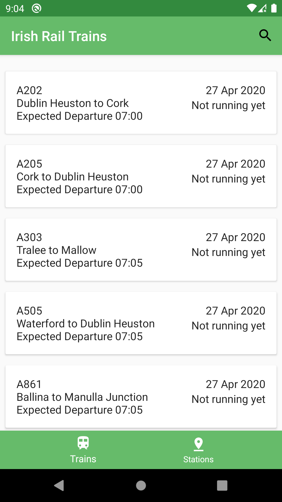
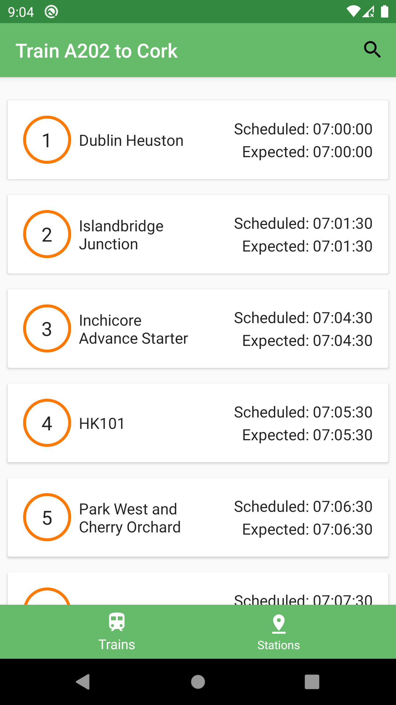
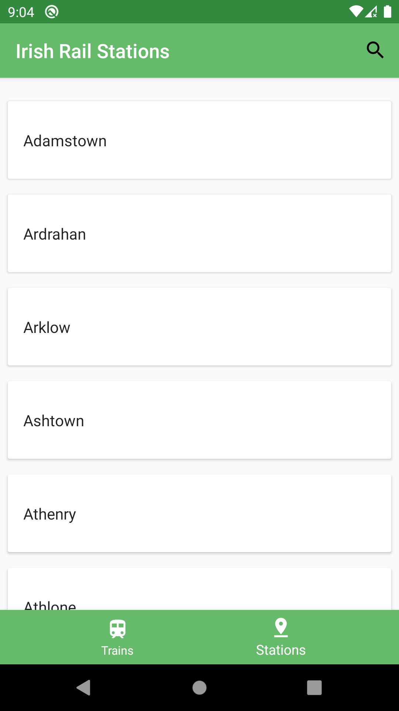
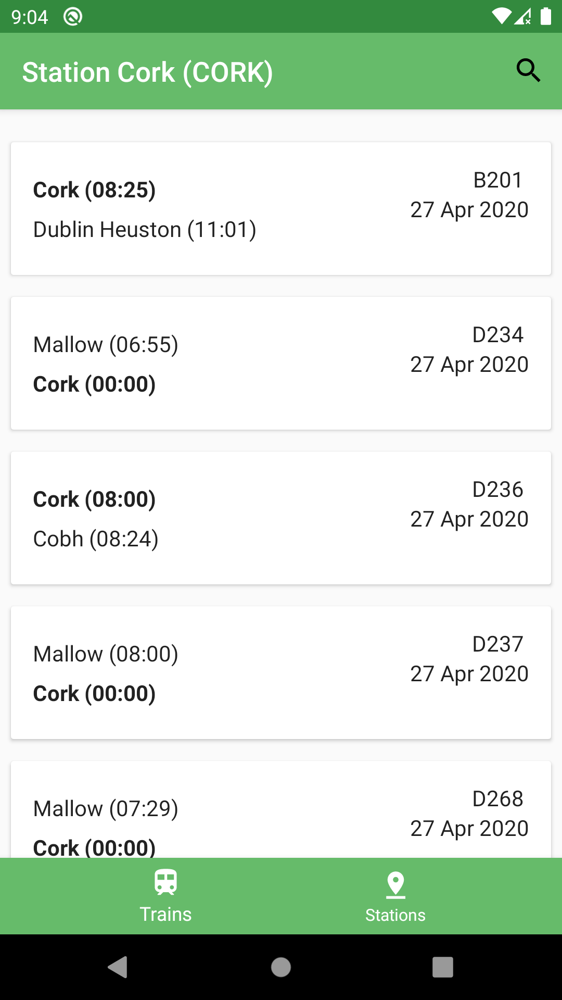

Irish Rail App
==============

# Features

The app displays lists of rail data - trains and stations.
It allows the user to filter this data by various properties (train code, station code, status, etc.).
Users can also see details about trains and stations and can cross navigate between the them.

  
  

  
  

# Development Environment

The app is written entirely in Kotlin and uses the Gradle build system.

To build the app, use the `gradlew build` command or use "Import Project" in
Android Studio. `MinSdkVersion` is 28.

# Architecture

The architecture is built around
[Android Architecture Components](https://developer.android.com/topic/libraries/architecture/).

Followed the recommendations laid out in the
[Guide to App Architecture](https://developer.android.com/jetpack/docs/guide)
when deciding on the architecture for the app. Logic is kept away from
Activities and Fragments and moved to
[ViewModel](https://developer.android.com/topic/libraries/architecture/viewmodel)s.
Observed data using
[LiveData](https://developer.android.com/topic/libraries/architecture/livedata)
and [Data Binding Library](https://developer.android.com/topic/libraries/data-binding/)
to bind UI components in layouts to the app's data sources.

Repository layer is used for handling data operations. Data comes
from a [Irish Rail Realtime API](http://api.irishrail.ie/realtime/) and is fetched on the go.
The repository modules are responsible for handling all data operations and abstracting the data sources
from the rest of the app. (if we wanted to swap the API for a different data source in the future,  
the architecture allows to do so in a clean way).

Implemented a lightweight domain layer, which sits between the data layer
and the presentation layer, and handles discrete pieces of business logic off
the UI thread. See the `UseCase.kt` files under `/domain` for
[examples](https://github.com/ivzb/irish_rail/search?q=UseCase&unscoped_q=UseCase).

Used [Navigation component](https://developer.android.com/guide/navigation)
to simplify into a single Activity app.

Used [Dagger2](https://github.com/google/dagger) for dependency injection
and heavily relied on
[dagger-android](https://google.github.io/dagger/android.html) to abstract away
boiler-plate code.
